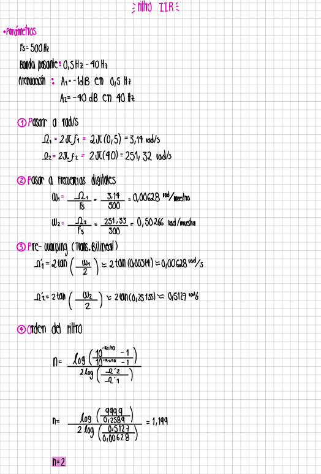
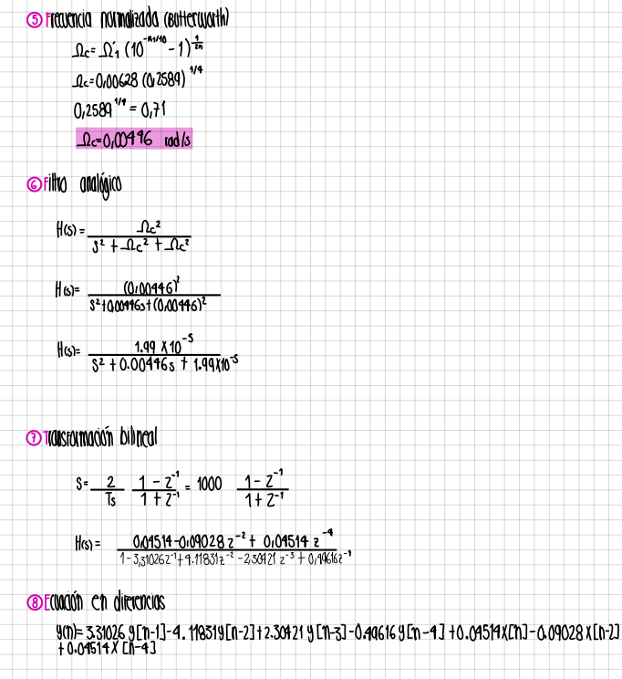

# VARIABILIDAD DE LA FRECUENCIA CARDIACA (HRV) Y BALANCE AUTONOMICO  LABORATORIO-5
## DESCRIPCIÓN 
Este laboratorio tiene como propósito analizar la variabilidad de la frecuencia cardíaca (HRV) como un indicador del balance entre la actividad simpática y parasimpática del sistema nervioso autónomo. Para ello, se adquiere una señal ECG real en dos condiciones fisiológicas diferentes (reposo y lectura en voz alta), se procesa digitalmente mediante filtrado, detección de picos R y cálculo de intervalos R-R, y finalmente se estudia la HRV tanto en el dominio del tiempo como mediante el diagrama de Poincaré, permitiendo obtener índices cuantitativos de actividad simpática y vagal. La práctica integra conceptos de fisiología, adquisición de señales y procesamiento digital. <br>
## OBJETIVOS
- Identificar cambios en el balance autonómico mediante análisis temporal de la variabilidad de la frecuencia cardíaca (HRV).<br>
- Analizar la variabilidad de la frecuencia cardíaca (HRV) como herramienta para evaluar el balance autonómico. <br>
- Adquirir y procesar correctamente una señal ECG utilizando métodos de filtrado y detección de picos R. <br>
- Comparar la respuesta autonómica del sujeto entre reposo y lectura en voz alta. <br>
- Aplicar herramientas de análisis temporal y no lineal (diagrama de Poincaré) para caracterizar la HRV.<br>
- Interpretar resultados fisiológicos relacionados con actividad simpática y parasimpática. <br> 

# PARTE A - Fundamento teórico y adquisición de señal
## Descripción 
En esta parte se realiza la investigación teórica necesaria para comprender la variabilidad de la frecuencia cardiaca (HRV) y su relación con el sistema nervioso autónomo. Luego, se adquiere la señal ECG de un sujeto en dos condiciones distintas: reposo y lectura en voz alta, con el fin de analizar cómo cambia el balance simpático-parasimpático. <br> 
## Diagrama 
/><br> 


##  𝘼𝙘𝙩𝙞𝙫𝙞𝙙𝙖𝙙 𝙎𝙞𝙢𝙥𝙖𝙩𝙞𝙘𝙖 𝙮 𝙋𝙖𝙧𝙖𝙨𝙞𝙢𝙥𝙖𝙩𝙞𝙘𝙖 𝙙𝙚𝙡 𝙨𝙞𝙨𝙩𝙚𝙢𝙖 𝙣𝙚𝙧𝙫𝙞𝙤𝙨𝙤 𝙖𝙪𝙩𝙤𝙣𝙤𝙢𝙤 
El cuerpo humano está preparado para mantener un equilibrio entre la actividad y el descanso. Esto es posible gracias al sistema nervioso autónomo, encargado de regular muchas funciones involuntarias del organismo. Dentro de este sistema se encuentran el sistema nervioso simpático y el sistema nervioso parasimpático, dos fuerzas opuestas que actúan de manera complementaria para preservar el bienestar y la estabilidad del cuerpo.<br>

### Sistema nervioso simpático
Este sistema es el encargado de activar y acelerar las funciones del cuerpo, siendo responsable de la respuesta de “huida o lucha” cuando una persona se enfrenta a una situación de peligro o estrés. Su acción es crucial incluso en reposo, ya que prepara al organismo para responder ante emergencias.
El sistema nervioso simpático actúa mediante la activación de diferentes vías, lo que provoca un aumento del ritmo cardíaco y respiratorio, elevación de la presión arterial, dilatación de las pupilas y una redistribución del flujo sanguíneo: la sangre se desvía de la piel, el estómago y los intestinos para dirigirse al cerebro, al corazón y a los músculos necesarios para ejecutar una respuesta rápida frente a la actividad simpática.<br>
<br>

### Sistema nervioso parasimpatico
Este sistema controla la actividad del músculo liso, del músculo cardíaco y de las glándulas. Se encarga de la respuesta de descanso, ya que participa en la disminución del ritmo cardíaco, la relajación del tracto gastrointestinal y urinario, y el aumento de la actividad glandular e intestinal. Como resultado, el sistema parasimpático promueve el almacenamiento de energía y regula funciones vitales del organismo, como la digestión y la micción.<br>
<br>

##  𝙀𝙛𝙚𝙘𝙩𝙤 𝙙𝙚 𝙡𝙖 𝙖𝙘𝙩𝙞𝙫𝙞𝙙𝙖𝙙 𝙨𝙞𝙢𝙥𝙖𝙩𝙞𝙘𝙖 𝙙𝙚𝙡 𝙨𝙞𝙨𝙩𝙚𝙢𝙖 𝙣𝙚𝙧𝙫𝙞𝙤𝙨𝙤 𝙖𝙪𝙩𝙤𝙣𝙤𝙢𝙤:

La regulación de la frecuencia cardíaca depende de la acción conjunta del sistema nervioso simpático y parasimpático. Ambos modulan la actividad de los nodos cardíacos y la contractilidad del miocardio mediante comunicación eléctrica y neuroquímica. El sistema simpático favorece el aumento de la frecuencia cardíaca, mientras que el parasimpático la reduce, relajando el corazón. El equilibrio entre ambos mantiene la homeostasis cardiovascular; cuando este balance se altera, pueden aparecer diversas condiciones y patologías.<br>

El corazón recibe inervación de ambas ramas del sistema nervioso autónomo a través del plexo cardíaco, situado alrededor de la base del corazón y de los grandes vasos. La inervación simpática se origina en la médula espinal a nivel torácico: las fibras preganglionares llegan al plexo y se distribuyen hacia los nodos SA, AV y el miocardio, liberando noradrenalina sobre los receptores beta-1 adrenérgicos, lo que incrementa la contractilidad y la frecuencia cardíaca.<br>

Por otro lado, el sistema parasimpático proviene del nervio vago. Sus fibras preganglionares hacen sinapsis en ganglios intrínsecos ubicados en la grasa cardíaca y la pared auricular. Luego liberan acetilcolina (ACh) sobre receptores muscarínicos M2 acoplados a proteínas G, lo que abre canales de potasio e hiperpolariza la membrana del nodo SA, alejando el potencial de membrana del umbral. Además, se reduce el AMPc y con ello la velocidad de conducción, ralentizando la despolarización espontánea y disminuyendo la contractilidad auricular y la frecuencia cardíaca.<br>

<br>

##  V𝙖𝙧𝙞𝙖𝙗𝙞𝙡𝙞𝙙𝙖𝙙 𝙙𝙚 𝙡𝙖 𝙛𝙧𝙚𝙘𝙪𝙚𝙣𝙘𝙞𝙖 𝙘𝙖𝙧𝙙𝙞𝙖𝙘𝙖 (𝙃𝙍𝘾) 𝙤𝙗𝙩𝙚𝙣𝙞𝙙𝙖 𝙖 𝙥𝙖𝙧𝙩𝙞𝙧 𝙙𝙚 𝙡𝙖 𝙨𝙚𝙣̃𝙖𝙡 𝙚𝙡𝙚𝙘𝙩𝙧𝙤𝙘𝙖𝙧𝙙𝙞𝙤𝙜𝙧𝙖𝙛𝙞𝙘𝙖 (𝙀𝘾𝙂).

La variabilidad de la frecuencia cardíaca (HRV) analiza cómo cambia el tiempo entre un latido y otro del corazón, es decir, los intervalos RR obtenidos a partir del ECG. Estos cambios reflejan el equilibrio entre el sistema simpático y parasimpático, que regulan la actividad cardíaca.
Para calcularla, primero se detectan los picos R de la señal y se mide el intervalo entre cada par consecutivo. Con esta serie de datos se aplica un análisis en el dominio del tiempo o en el dominio de la frecuencia. En el primero suelen usarse parámetros como SDNN y RMSSD, mientras que en el segundo se estudian componentes como LF y HF, cuyo cociente LF/HF permite estimar el balance autonómico.<br>

La HRV se ha convertido en un indicador útil tanto en investigación como en clínica. Una variabilidad alta suele relacionarse con buena salud y adaptación fisiológica, mientras que una variabilidad baja puede asociarse con estrés o alteraciones autonómicas. Por ello, el análisis de HRV a partir del ECG es considerado un método no invasivo y confiable para evaluar el control nervioso del corazón.<br> 
<br>


# PARTE B - Preprocesamiento, filtrado, detección de picos R y HRV en dominio del tiempo
## Descripción
En esta sección se implementan las etapas de procesamiento digital necesarias para limpiar la señal ECG, extraer los picos R y calcular los intervalos R-R. La señal es filtrada utilizando un filtro IIR diseñado por el estudiante, posteriormente se divide según las dos condiciones experimentales y se obtiene la serie temporal de HRV para cada segmento. <br> 
##Diagrama 
<br> 

## Diseño Filtro





## CODIGO 
```
# ============================================
#      LAB ECG - PREPROCESAMIENTO + HRV
#   FILTRO IIR + R-PEAKS + RR + POINCARÉ
#   ZOOM EN QRS + PICOS R MORADOS + RR MARCADO
# ============================================

import numpy as np
import pandas as pd
import matplotlib.pyplot as plt
from scipy import signal
from google.colab import drive

# ============================================
# 1. MONTAR GOOGLE DRIVE
# ============================================
drive.mount('/content/drive')
# ============================================
# 2. PARÁMETROS
# ============================================
Fs = 500.0
seg_duration_s = 2 * 60  # 2 minutos

# Filtro IIR digital (orden 4)
b = np.array([0.04514067, 0.0, -0.09028134, 0.0, 0.04514067])
a = np.array([1.0, -3.31025739, 4.11831107, -2.30421103, 0.49616466])

```
Este fragmento define el inicio del procesamiento del laboratorio de ECG. Se importan las librerías necesarias para cargar datos, filtrarlos y graficar resultados. Luego se monta Google Drive para acceder a los archivos del experimento. Después se establecen los parámetros principales: la frecuencia de muestreo de la señal (500 Hz) y la duración de cada segmento de análisis (2 minutos). Finalmente, se declaran los coeficientes b y a del filtro digital IIR de orden 4, que será utilizado más adelante para limpiar la señal ECG antes de realizar la detección de picos R y el análisis de HRV. <br>

```
# ============================================
# 3. ECUACIÓN EN DIFERENCIAS
# ============================================
def print_difference_equation():
    print("\n=== ECUACIÓN EN DIFERENCIAS DEL FILTRO IIR ===\n")
    print(
        "y[n] = "
        + f"{b[0]:.8f} x[n] + "
        + f"{b[1]:.8f} x[n-1] + "
        + f"{b[2]:.8f} x[n-2] + "
        + f"{b[3]:.8f} x[n-3] + "
        + f"{b[4]:.8f} x[n-4] "
        + f"- {a[1]:.8f} y[n-1] - {a[2]:.8f} y[n-2] - {a[3]:.8f} y[n-3] - {a[4]:.8f} y[n-4]"
    )
    print("\n(Estados iniciales = 0)\n")
    )
```
Este fragmento de código carga una señal ECG, la filtra con un IIR de orden 4, detecta los picos R usando un método basado en derivada–cuadrado–ventana móvil, calcula los intervalos RR y sus versiones interpoladas, obtiene los índices de variabilidad cardíaca (SD1, SD2, CSI y CVI) y genera diversas gráficas: señal original vs filtrada, picos R marcados en morado, zoom del complejo QRS, curva RR(t) y diagramas de Poincaré para analizar la dinámica del ritmo cardiaco.. <br> 

```
# ============================================
# 4. CARGAR ECG
# ============================================
def load_ecg(path):
    df = pd.read_csv(path)

    if df.shape[1] == 1:
        x = df.iloc[:, 0].astype(float).values
        t = np.arange(len(x)) / Fs
        return t, x, Fs

    elif df.shape[1] == 2:
        t = df.iloc[:, 0].astype(float).values
        x = df.iloc[:, 1].astype(float).values
        Fs_est = 1.0 / np.mean(np.diff(t))
        return t, x, Fs_est

    else:
        raise ValueError("El CSV debe tener 1 o 2 columnas.")

```
Este fragmento lee un archivo CSV que contiene un ECG y organiza los datos según su formato: si el archivo tiene una sola columna, la toma como la señal ECG y crea el vector de tiempo usando la frecuencia de muestreo definida; si tiene dos columnas, interpreta la primera como tiempo y la segunda como la señal, calculando además la frecuencia de muestreo a partir de las diferencias entre muestras. Si el archivo no tiene 1 o 2 columnas, genera un error indicando que el formato no es válido. <br>

```
# ============================================
# 5. FILTRADO
# ============================================
def apply_iir(x):
    return signal.filtfilt(b, a, x)
```
Este fragmento aplica el filtro IIR definido por los coeficientes b y a a la señal ECG x utilizando filtfilt(), que realiza un filtrado hacia adelante y hacia atrás para evitar el desfase y obtener una señal filtrada sin retraso en fase. En resumen, limpia la señal eliminando ruido sin distorsionar la forma del ECG.<br> 

```
# ============================================
# 6. DETECCIÓN DE PICOS R
# ============================================
def detect_r_peaks(ecg_segment, fs):
    diff = np.diff(ecg_segment, prepend=ecg_segment[0])
    sq = diff**2
    win = max(1, int(150 * fs / 1000))
    integ = np.convolve(sq, np.ones(win)/win, mode='same')

    dist = int(0.25 * fs)
    thresh = np.mean(integ) + 0.5 * np.std(integ)
    peaks, _ = signal.find_peaks(integ, distance=dist, height=thresh)

    refined = []
    radius = int(0.05 * fs)
    for p in peaks:
        L = max(0, p - radius)
        R = min(len(ecg_segment)-1, p + radius)
        local = L + np.argmax(ecg_segment[L:R+1])
        refined.append(local)

    return np.unique(refined), integ

```
Este fragmento detecta los picos R dentro de un segmento de ECG. Primero calcula la derivada de la señal y la eleva al cuadrado para resaltar los complejos QRS; luego aplica una ventana móvil de 150 ms para obtener una señal integrada que facilita la detección. A partir de esta señal integrada, busca picos usando un umbral adaptativo y una distancia mínima entre latidos (250 ms). Después, cada pico inicial se refina buscando, en una ventana pequeña alrededor, el máximo real del ECG para ubicar con precisión el pico R. Finalmente, devuelve la lista de picos R detectados y la señal integrada usada en el proceso.<br>

```
# ============================================
# 7. INTERVALOS RR
# ============================================
def compute_rr(peaks, fs):
    if len(peaks) < 2:
        return np.array([])
    return np.diff(peaks) / fs


# RR interpolada para graficar
def interpolate_rr(peaks, rr, fs, total_len):
    if len(rr) < 2:
        return None, None
    t_rr = peaks[1:] / fs
    t = np.arange(total_len) / fs
    rr_interp = np.interp(t, t_rr, rr * 1000)
    return t, rr_interp

```
Este fragmento calcula los intervalos RR y genera una versión interpolada para graficarlos de manera continua. La función compute_rr() toma las posiciones de los picos R y obtiene los intervalos RR dividiendo la diferencia entre picos consecutivos por la frecuencia de muestreo. La función interpolate_rr() usa esos RR ya calculados para construir una señal RR(t) suave: primero obtiene el tiempo exacto de cada intervalo RR, luego genera una escala temporal uniforme y finalmente interpola los valores para obtener una curva continua en milisegundos. Si no hay suficientes RR, ambas funciones devuelven resultados vacíos.<br>

```
# ============================================
# 9. FUNCIÓN PRINCIPAL
# ============================================
def process_ecg_file(path):

    print("\nCargando archivo:", path)
    t, x, fs = load_ecg(path)

    print(f"Señal cargada: {len(x)} muestras — Fs={fs:.2f} Hz")
    print_difference_equation()

    # -----------------------
    # FILTRADO
    # -----------------------
    x_f = apply_iir(x)

    plt.figure(figsize=(18,5))
    plt.plot(t, x, alpha=0.5, label="Original")
    plt.plot(t, x_f, color="#FF00FF", label="Filtrada")
    plt.title("Señal Original vs Filtrada")
    plt.legend()
    plt.grid()
    plt.show()
```
Este fragmento de la función principal carga la señal ECG desde el archivo indicado, muestra en pantalla cuántas muestras tiene y cuál es la frecuencia de muestreo estimada, imprime la ecuación en diferencias del filtro IIR que se usará y luego aplica dicho filtro a la señal para eliminar ruido sin introducir desfase. Finalmente, grafica la señal original junto con la señal filtrada, permitiendo visualizar claramente el efecto del filtrado sobre el ECG.<br>

```

    # -----------------------
    # SEGMENTOS
    # -----------------------
    seg_len = int(seg_duration_s * fs)
    seg1 = x_f[:seg_len]
    seg2 = x_f[seg_len:2*seg_len]

    # -----------------------
    # DETECCIÓN R
    # -----------------------
    p1, _ = detect_r_peaks(seg1, fs)
    p2, _ = detect_r_peaks(seg2, fs)

    # ---------------------------------------------------------
    #   ECG FILTRADA + PICOS R (MORADO)
    # ---------------------------------------------------------
    plt.figure(figsize=(18,6))
    plt.plot(seg1, color="#FF00FF", label="ECG Filtrada")
    plt.scatter(p1, seg1[p1], color="purple", s=25, label="R-peaks")
    plt.title("Segmento 1 — ECG Filtrada + Picos R (Morado)")
    plt.legend(); plt.grid(); plt.show()

    plt.figure(figsize=(18,6))
    plt.plot(seg2, color="#FF00FF", label="ECG Filtrada")
    plt.scatter(p2, seg2[p2], color="purple", s=25, label="R-peaks")
    plt.title("Segmento 2 — ECG Filtrada + Picos R (Morado)")
    plt.legend(); plt.grid(); plt.show()

    # -----------------------
    # ZOOM EN QRS (Modo B)
    # -----------------------
    def zoom_qrs(seg, peaks, title):
        i1 = peaks[5] - 200
        i2 = peaks[10] + 200
        i1 = max(0, i1)
        i2 = min(len(seg), i2)
        plt.figure(figsize=(18,5))
        plt.plot(seg[i1:i2], color="#FF00FF")
        plt.title(title)
        plt.grid()
        plt.show()

    zoom_qrs(seg1, p1, "Zoom centrado en QRS — Segmento 1")
    zoom_qrs(seg2, p2, "Zoom centrado en QRS — Segmento 2")

```
Este fragmento divide la señal ECG filtrada en dos segmentos de dos minutos, detecta los picos R en cada uno y luego genera visualizaciones que permiten evaluar la calidad de la detección. Primero calcula cuántas muestras corresponden a dos minutos y separa la señal en segmento 1 (reposo) y segmento 2 (lectura). Después aplica el algoritmo de detección de picos R a cada segmento para obtener las posiciones de los complejos QRS. Posteriormente grafica cada segmento mostrando la señal filtrada en magenta y los picos R marcados en color morado, facilitando la verificación visual de la detección. Finalmente, incluye una función que realiza un zoom alrededor de algunos complejos QRS para observarlos en detalle y confirmar que los picos detectados coinciden con la morfología real del QRS.<br>

```
# -----------------------
    # RR
    # -----------------------
    rr1 = compute_rr(p1, fs)
    rr2 = compute_rr(p2, fs)

    t1_rr, rr1_ts = interpolate_rr(p1, rr1, fs, len(seg1))
    t2_rr, rr2_ts = interpolate_rr(p2, rr2, fs, len(seg2))

    # ---------------------------------------------------------
    # RR(t) CON MARCADORES DE RR REALES
    # ---------------------------------------------------------
    plt.figure(figsize=(18,5))
    plt.plot(t1_rr, rr1_ts, color="#FF00FF", label="RR(t) interpolado")
    plt.scatter(p1[1:]/fs, rr1*1000, color="purple", s=30, label="RR reales")
    plt.title("RR(t) — Segmento 1")
    plt.xlabel("Tiempo (s)")
    plt.ylabel("Intervalo RR (ms)")
    plt.legend()
    plt.grid()
    plt.show()

    plt.figure(figsize=(18,5))
    plt.plot(t2_rr, rr2_ts, color="#FF00FF", label="RR(t) interpolado")
    plt.scatter(p2[1:]/fs, rr2*1000, color="purple", s=30, label="RR reales")
    plt.title("RR(t) — Segmento 2")
    plt.xlabel("Tiempo (s)")
    plt.ylabel("Intervalo RR (ms)")
    plt.legend()
    plt.grid()
    plt.show()
```
Este fragmento calcula los intervalos RR de cada segmento y genera las gráficas que muestran su evolución temporal. Primero obtiene los RR reales restando las posiciones consecutivas de los picos R y convirtiéndolos a segundos. Luego interpola estos valores para construir una señal continua RR(t), lo que permite visualizar la variabilidad latido a latido sin saltos. Después grafica, para cada segmento, la curva RR(t) en color magenta y superpone los valores reales de los intervalos RR como puntos morados, de modo que se puede comparar la interpolación con los datos originales y analizar cómo cambia el ritmo cardíaco durante el reposo y durante la lectura.<br>

## GRAFICAS 
<br>
La gráfica muestra la comparación entre la señal ECG original y la señal filtrada mediante un filtro IIR de cuarto orden. La señal cruda presenta variaciones y componentes de alta frecuencia no deseados, mientras que la señal filtrada en color magenta evidencia una reducción significativa del ruido sin distorsionar la morfología del ECG. Este preprocesamiento permite resaltar los complejos QRS y preparar la señal para la detección precisa de picos R y el posterior análisis de variabilidad cardíaca (HRV).<br>

<br>
La gráfica muestra el primer segmento de la señal ECG ya filtrada y los picos R identificados automáticamente, representados como puntos morados sobre la onda. La señal filtrada permite observar con claridad la morfología del complejo QRS, mientras que la marcación de los picos R confirma la correcta detección de los latidos durante los primeros dos minutos en reposo. Esta visualización es fundamental para validar el preprocesamiento y garantizar la precisión en el cálculo posterior de los intervalos R-R y el análisis de variabilidad cardíaca (HRV).<br>

<br>
La gráfica del segundo segmento muestra la señal ECG filtrada durante la etapa de lectura en voz alta, junto con los picos R detectados automáticamente y marcados en color morado. Este periodo presenta una mayor variabilidad en la amplitud y en la distribución de los latidos, reflejando la influencia del esfuerzo cognitivo y vocal sobre el ritmo cardíaco. La correcta identificación de los picos R permite analizar cómo cambia la actividad cardíaca frente a una tarea activa, y sirve como base para el cálculo de los intervalos R-R y la evaluación del comportamiento autonómico en comparación con el reposo.<br>

<br>
La gráfica presenta un zoom del complejo QRS en el primer segmento, permitiendo observar con mayor detalle la morfología característica de cada latido. Al ampliar esta región, se evidencia un QRS bien definido y consistente, confirmando que el filtrado y la detección de picos R fueron precisos. Esta visualización es fundamental para validar que los puntos detectados corresponden efectivamente a los máximos del complejo QRS, garantizando la confiabilidad del cálculo posterior de los intervalos R-R y del análisis de variabilidad cardíaca.<br>

<br>
La gráfica muestra un zoom enfocado en los complejos QRS del segundo segmento de la señal de ECG, permitiendo observar con mayor detalle los picos asociados a la despolarización ventricular. Se aprecia un ritmo relativamente regular y amplitudes que oscilan entre aproximadamente −1.5 y +1.7 mV, lo cual es coherente con una señal cardíaca fisiológica. Este análisis resulta clave para validar la calidad del registro y preparar el procesamiento posterior, como la detección automática de picos R, segmentación de latidos o implementación de algoritmos como Pan–Tompkins.<br>

<br>
La gráfica representa la evolución temporal del intervalo RR correspondiente al primer segmento de la señal de ECG. Se muestran los valores reales calculados a partir de los picos R y una curva interpolada que suaviza la variabilidad latido a latido. Se observa un ritmo cardíaco relativamente estable, con intervalos que oscilan mayormente entre 500 y 650 ms, salvo algunas variaciones puntuales que podrían estar asociadas a artefactos o fluctuaciones fisiológicas. Este análisis permite visualizar la dinámica de los intervalos RR y constituye la base para evaluar la variabilidad cardíaca (HRV) y explorar el estado autonómico del paciente.<br>

<br>
La gráfica muestra la variación del intervalo RR a lo largo del segundo segmento de la señal de ECG. Los valores reales calculados a partir de los picos R se comparan con la curva interpolada, la cual permite visualizar de forma más continua la dinámica cardíaca. En este segmento se observan fluctuaciones más amplias que en el segmento anterior, con picos aislados que superan los 1200 ms e indican posibles latidos ectópicos o irregularidades transitorias. Aun así, el patrón general permanece dentro de un rango fisiológico, lo que permite usar este segmento para el análisis de variabilidad cardíaca (HRV) y la evaluación del balance autonómico.<br>
                                                                                                                                    


# PARTE C - Diagrama de Poincaré y análisis del balance autonómico
## Descripción
Esta parte consiste en construir el diagrama de Poincaré para cada segmento de ECG y analizar la dispersión de los puntos para determinar cambios en la actividad simpática y vagal. Se calculan los índices CSI (simpático) y CVI (vagal) y se comparan entre reposo y lectura.<br>
## Diagrama 


## CODIGO 
```

```
s.<br> 

```
 
```
S <br> 
```

```
S. <br>

# REFERENCIAS 
[1]Researchgate.net.de https://www.researchgate.net/figure/Figura-173-Los-sistemas-simpatico-y-parasimpatico_fig2_313160220

[2]Sistema nervioso simpático. (2023, 30 octubre). Kenhub. https://www.kenhub.com/es/library/anatomia-es/sistema-nervioso-simpatico

[3]Sistema nervioso parasimpático. (2023, 30 octubre). Kenhub. https://www.kenhub.com/es/library/anatomia-es/sistema-nervioso-parasimpatico 
